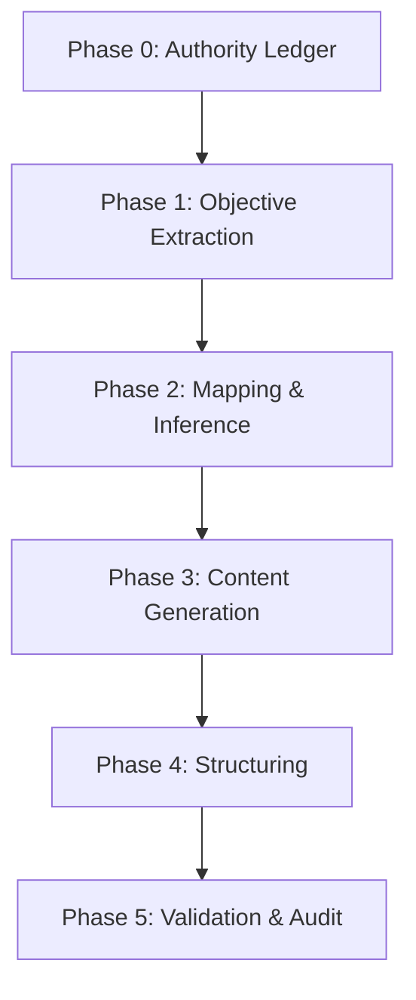

# Execution Model (Authoritative)

This repository documents a **GPT-executed generative pipeline**.

⚠️ No local scripts in this repository are executed as part of generation.

All generation, validation, and phase progression is performed by a GPT operator
following the **Generative Execution DAG (GED)**.

Local Python scripts are **REFERENCE ONLY**:
- They MUST NOT be executed
- They express structure, invariants, and expected artifacts
- They support audit, reasoning, and future automation

---

## Generative Execution DAG (GED)

The GED is the **canonical controller**. No phase may be entered unless all
upstream nodes are satisfied.
