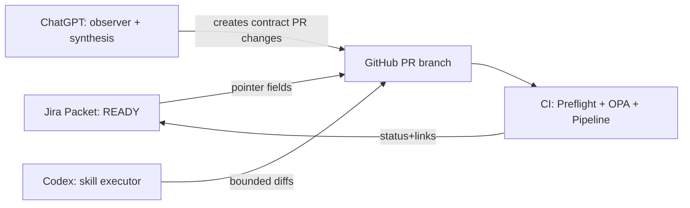

# Integration Plan — Jira × GitHub × Codex × ChatGPT (cbia-builder)

## Purpose
Create a **deterministic, auditable** workflow where:
- **Jira** provides *planning + state + approvals + routing*
- **GitHub** is the **single source of truth (SSOT)** for contracts, policies, code, and evidence
- **CI** is the trusted execution substrate
- **Codex** is the constrained executor (skill-driven)
- **ChatGPT** is the external observer/controller assisting intent capture + contract synthesis

## Non‑negotiable principles
1. **Repo-as-SSOT**: Jira never holds authoritative execution content. Jira stores **pointers**, not “live instructions”.
2. **Explicit-only execution**: all actions are driven by **in-repo contracts** + **OPA/Control Kernel** gates.
3. **One-way causality** (avoid loops): either Jira→GitHub triggers *or* GitHub→Jira status sync; never both as primary.
4. **Evidence first**: every run emits ledger artifacts (hashes, OPA decision/explain, manifests) and links them back to Jira.

---

## System roles
### Jira (supervisory controller)
- Intake (Packet request)
- Status machine (READY → RUNNING → BLOCKED/DENIED → DONE)
- Approval gates (human)
- Routing / prioritization (boards, queues)

### GitHub (plant + SSOT)
- Stores:
  - packet contracts under `control/packets/`
  - skills under `.codex/skills/<skill>/`
  - control kernel + OPA bundle under `control/{kernel,policy}`
  - generated artifacts + evidence under `execution/ledger/` and `cbia-content/`
- Enforces:
  - CI checks
  - regen-and-compare
  - OPA allow/deny

### CI (trusted runner)
- Executes:
  - preflight structural checks
  - OPA gating
  - pipeline stages (GEN/CHECK/REPAIR/PROMOTE as defined)
- Emits immutable evidence

### Codex (executor)
- Operates *only* inside:
  - a specific PR branch
  - a specific **skill contract**
  - explicit allowed paths, budgets, and reason-code STOP terminals

### ChatGPT (external observer)
- Produces:
  - packet drafts
  - contract templates
  - checklists
  - constrained diffs/plans
- Never becomes SSOT: output must land in GitHub PR as files.

---

## Minimum viable integration (Tier 0)
**Goal:** get deterministic flow with minimal SaaS automation.

### Flow
1. Create Jira issue: `PACKET-###`
2. Add required pointer fields (below)
3. Human creates branch + PR in GitHub
4. Codex executes skill on PR
5. CI gates + runs
6. Human updates Jira status + links PR/run evidence

**Use when:** you want immediate control, minimal moving parts.

---

## Recommended integration (Tier 1)
**Goal:** Jira is the cockpit; GitHub is execution; status sync is automatic.

### Primary direction
**GitHub → Jira** for status updates (recommended for determinism).

### Flow
1. Jira issue moved to **READY** (human approval)
2. Human (or automation) creates PR branch named deterministically:
   - `packet/<JIRAKEY>-<slug>`
3. PR contains *only pointers* + contract additions:
   - `control/packets/<JIRAKEY>-contract.md`
4. CI runs preflight + OPA gate.
5. CI posts status back to Jira:
   - transition issue
   - comment with links (PR, commit SHA, run ledger, OPA decision)

---

## Advanced integration (Tier 2)
**Goal:** reduce “ball throws” further.

### Option A — Jira Automation creates branch
- Jira transition to READY triggers **Create GitHub branch**.
- Still keep **GitHub → Jira** as status-only (no loops).

### Option B — ChatGPT connects to Jira/Confluence
- If you later adopt an Atlassian↔ChatGPT connector:
  - ChatGPT reads issue fields + Confluence reference pages
  - ChatGPT generates in-repo contract PR changes

**Note:** treat connectors as *convenience*, never SSOT.

---

## Jira configuration
### Project types
- One Jira project for **cbia-builder ops** (recommended):
  - `CBIA` project

### Issue types
- **Packet** (primary)
- **Run** (optional; or use CI artifacts only)
- **Incident** (failure handling)

### Required fields (Packet)
Store only pointers/hashes.

| Field | Type | Example | Rule |
|---|---|---|---|
| `repo` | text | `fatb4f/cbia-builder` | SSOT location |
| `base_ref` | text | `main` | immutable reference |
| `branch` | text | `packet/CBIA-123-anti-regression` | deterministic naming |
| `pr_url` | url | … | set after PR exists |
| `contract_path` | text | `control/packets/CBIA-123-contract.md` | required |
| `skill_id` | text | `pipeline-sre` | required |
| `allowed_paths` | text | `control/**,.codex/**,tools/**` | pointer only |
| `diff_budget` | number | `N files / M LOC` | enforced in CI |
| `run_id` | text | `2026-01-12T...` | written by CI |
| `opa_decision_hash` | text | `sha256:...` | written by CI |

### Workflow (Packet)
- **DRAFT** → **READY** → **RUNNING** → **DONE**
- Failure terminals:
  - **DENIED (OPA)**
  - **BLOCKED (Preflight)**
  - **INCIDENT**

### Board
- Simple Kanban with WIP limits.

---

## GitHub configuration
### Repo conventions
- Branch naming: `packet/<JIRAKEY>-<slug>`
- PR title prefix: `[<JIRAKEY>] ...`
- PR description must include: `Closes <JIRAKEY>` (or `Closes #<issue>` if using GitHub issues)

### Required in-repo contract artifacts
- Packet contract: `control/packets/<JIRAKEY>-contract.md`
- Skill assets: `.codex/skills/<skill>/SKILL.md` + machine-readable constraints if used
- Plant maps / DAGs (generated): `control/plant/*.json` + `control/plant/*.mmd` (Mermaid view)

### CI gates (minimum)
1. **Structure preflight** (allowed paths, forbidden outputs, budgets)
2. **Regen-and-compare** for generated plant maps
3. **OPA allow/deny** with explain artifacts
4. **Artifact hash ledger** emission

---

## Event routing and status sync
### Preferred: GitHub → Jira (status-only)
- CI job step posts to Jira:
  - transition issue
  - comment with:
    - commit SHA
    - PR link
    - OPA decision result + hash
    - run ledger link/artifact

### Authentication options
- Jira API token for a dedicated “CI bot” user
- Store token in GitHub Actions secrets

---

## Control gates and invariants
### Invariants (must hold)
- Jira holds **no executable instructions**.
- Every run is traceable: `JiraKey → PR → commit → run ledger → OPA decision/explain`.
- CI is the only place where **PROMOTE** can occur.
- Codex changes must be bounded by skill constraints (paths, budgets, STOP terminals).

### External-Observer Feedback Loop (EOFL)
- Treat Jira transitions as the operational triggers:
  - READY transition requires:
    - Observer Snapshot
    - Pre-Action Gate
  - DONE transition requires:
    - Post-Action Update (linked evidence)

---

## Mermaid overview

---

## Implementation checklist (Tier 1 target)
### Jira
- [ ] Create `CBIA` project
- [ ] Add Packet issue type + required fields
- [ ] Create Packet workflow + failure terminals
- [ ] Create Kanban board

### GitHub
- [ ] Add CI job: preflight + regen-compare + OPA gate + ledger artifacts
- [ ] Add Jira status sync step (CI bot token)
- [ ] Define branch naming convention + PR template

### Codex
- [ ] Ensure `.codex/skills/<skill>/` exists and is contract-complete
- [ ] Skill declares:
  - allowed paths
  - forbidden outputs
  - diff budgets
  - STOP terminals

### ChatGPT
- [ ] Standardize “Packet intake” prompt template:
  - JiraKey
  - contract_path
  - skill_id
  - success predicate
  - bounds

---

## Tier-Structured Implementation Plan (SaaS + Repo)

### Tier 0 — Manual, deterministic baseline (no SaaS automation)
**Goal:** prove the control model end-to-end with the fewest moving parts.

**Prereqs**
- Jira site exists; you can create issues.
- GitHub repo has CI (even minimal) and the Control Kernel/OPA gate is already canonical.

**Steps**
- **Jira**
  - Create project `CBIA` (or reuse existing).
  - Create issue type: **Packet**.
  - Create minimal required fields (text fields are fine initially): `repo`, `base_ref`, `branch`, `contract_path`, `skill_id`, `diff_budget`.
  - Create workflow: `DRAFT → READY → RUNNING → DONE` + terminals `DENIED`, `BLOCKED`, `INCIDENT`.
- **GitHub**
  - Create branch: `packet/<JIRAKEY>-<slug>`.
  - Create PR with:
    - `control/packets/<JIRAKEY>-contract.md`
    - any skill/plant artifacts required by the packet.
- **Codex**
  - Run the relevant skill against the PR branch (bounded edits only).
- **CI**
  - Run CI gates; collect evidence (OPA decision/explain + run ledger).
- **Jira**
  - Update Packet status manually; paste PR URL + evidence links.

**Deliverables**
- Packet issue fully populated with pointers.
- PR merged or explicitly denied with evidence.

**Verification**
- You can trace: `JiraKey → PR → commit SHA → OPA decision/explain → run ledger`.

**Rollback**
- Close Packet as `BLOCKED` and close PR (no merge).

---

### Tier 1 — GitHub → Jira status sync (recommended default)
**Goal:** reduce “ball throws” while keeping GitHub/CI authoritative.

**Prereqs**
- Tier 0 works at least once.
- You have Jira admin access and can create an API token.

**Steps**
- **Jira (API + permissions)**
  - Create a dedicated Jira user (or service account) for CI.
  - Create a Jira API token for that account.
  - Confirm it can:
    - read issues
    - add comments
    - transition issues (Packet workflow)
- **GitHub (secrets + CI step)**
  - Add GitHub Actions secrets:
    - `JIRA_BASE_URL` (e.g., `https://<site>.atlassian.net`)
    - `JIRA_EMAIL` (service account)
    - `JIRA_API_TOKEN`
    - `JIRA_PROJECT_KEY` (e.g., `CBIA`)
  - Add a CI step (post-gate) that:
    - extracts Jira key from branch/PR title
    - posts a comment with: PR link, commit SHA, OPA decision, ledger artifact links
    - transitions Packet to `RUNNING` at start and `DONE/DENIED/BLOCKED` at end

**Deliverables**
- CI automatically updates Jira Packet state and writes a structured run comment.

**Verification**
- Create a new Packet and run one PR: Jira updates without manual edits.

**Rollback**
- Disable the Jira-sync CI step (keep Tier 0 manual updates).

---

### Tier 2 — Jira-triggered branch/PR creation (optional)
**Goal:** Jira becomes the cockpit for launching work while preserving GitHub SSOT.

**Prereqs**
- Tier 1 stable.
- You accept that Jira automation can create side effects (branch creation), but execution remains CI-gated.

**Options**
- **Option A (lightweight):** Jira Automation → GitHub create branch (if available in your integration)
- **Option B (deterministic):** Jira Automation → send webhook to a GitHub workflow_dispatch endpoint that creates the branch/PR

**Steps (Option B recommended)**
- **GitHub**
  - Create a workflow `dispatch_create_packet_branch.yml` that:
    - takes inputs: `jira_key`, `slug`, `base_ref`
    - creates branch `packet/<jira_key>-<slug>`
    - opens a PR with a template body
- **Jira Automation**
  - Rule trigger: Packet transitioned to `READY`
  - Action: send webhook (or call GitHub API) to trigger the workflow with inputs.

**Deliverables**
- Transitioning Jira Packet to `READY` creates the branch/PR deterministically.

**Verification**
- READY transition produces exactly one PR; no duplicates.

**Rollback**
- Disable the automation rule (Tier 1 still works).

---

### Tier 3 — Full operational hardening (view-only SaaS surfaces)
**Goal:** treat SaaS as *readable control surfaces*, with all authority in-repo.

**Additions**
- **Jira**
  - Add guardrails:
    - required fields on READY transition
    - WIP limits via board discipline
  - Add Incident linkage:
    - CI failures auto-open Incident issues (status-only routing)
- **GitHub/CI**
  - Promote “no-hand-edit” generated artifacts:
    - CI regen-and-compare for plant maps/DAG JSON
  - Deterministic caching/replay (if already planned)
  - Stronger preflight budgets and reason codes
- **Confluence (optional)**
  - Publish *view-only* dashboards:
    - current Packet queue
    - run history
    - links to evidence artifacts

**Verification**
- Continuous operation: multiple packets run without manual state management.

---

## SaaS Integration Setup Notes (quick reference)
- **Jira API token (for CI bot):** required for Tier 1+.
- **Automation rules:** only needed Tier 2+.
- **Avoid loops:** ensure only one system is the “cause” and the other is “status-only”.

## Failure modes + responses
- **Form / auth failures** (Jira/Atlassian): treat as control-plane outage → manual Tier 0 steps.
- **Automation loops**: disable one side; keep GitHub→Jira status-only.
- **Scope drift** (instructions in Jira): deny in preflight if contract not in repo.
- **OPA denial**: Jira transitions to DENIED with explain link; open Incident if repeated.

---

## Roadmap
1. Tier 0: manual but deterministic.
2. Tier 1: CI → Jira status sync + strict pointer-only Jira fields.
3. Tier 2: optional Jira automation for branch creation + optional ChatGPT connector.
4. Tier 3: fully mechanical promotion + run/packet graphs materialized to Confluence (view-only).

